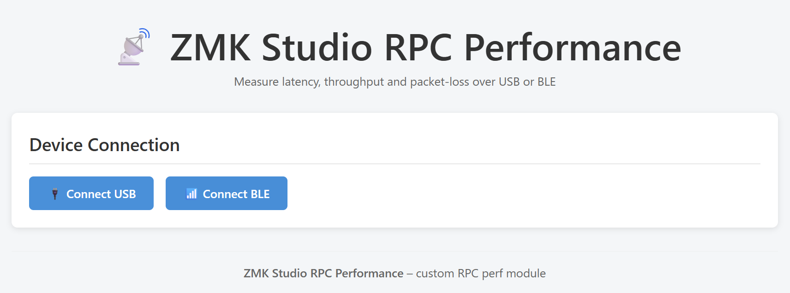
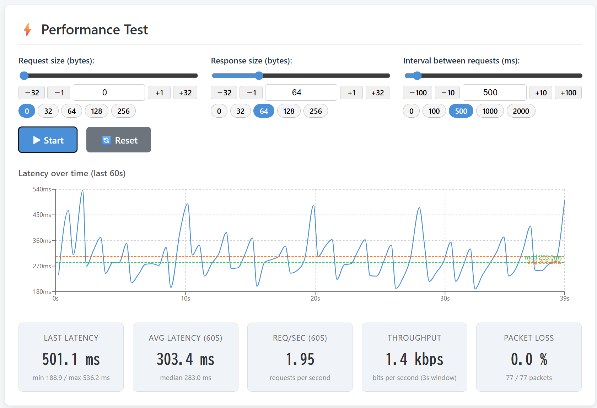

# zmk-feature-studio-rpc-perf


A ZMK module that measures the performance of the ZMK Studio custom RPC protocol.

https://cormoran.github.io/zmk-feature-studio-rpc-perf/




## Features

- **Adjustable payload sizes** – set both the request data size and the response data size bytes
- **Device limit display** – shows the firmware RPC buffer and split relay payload settings used
  to choose safe request/response sizes
- **Adjustable send frequency** – configurable interval (ms) between successive requests
- **Local or split target** – run the same test on the Studio central or through ZMK split relay events
- **Live statistics** displayed in the web UI:
  - Ping latency (current / min / max in ms)
  - Throughput (bits per second, computed over a 3-second sliding window)
  - Packet-loss rate (%) with raw sent/received counter
- **USB and BLE connection** – the web UI supports both USB serial and BLE (GATT)

## Setup

### 1. Add dependency to your `config/west.yml`

```yaml
manifest:
  remotes:
    ...
    - name: cormoran
      url-base: https://github.com/cormoran
  projects:
    ...
    - name: zmk-feature-studio-rpc-perf
      remote: cormoran
      revision: main
    # Required for unofficial studio custom RPC feature
    - name: zmk
      remote: cormoran
      revision: main+custom-studio-protocol
      import:
        file: app/west.yml
```

### 2. Enable flags in your `config/<shield>.conf`

```conf
CONFIG_ZMK_STUDIO=y
CONFIG_ZMK_STUDIO_RPC_PERF=y
CONFIG_ZMK_STUDIO_RPC_PERF_HANDLER=y
```

For BLE split testing, enable the module on both halves. The Studio-connected central also needs
`CONFIG_ZMK_STUDIO_RPC_PERF_HANDLER=y`; the peripheral only needs `CONFIG_ZMK_STUDIO_RPC_PERF=y`.
The split path uses typed ZMK relay events, so enable the perf split RPC relay config. Increase
the relay event payload size if you need larger split request or response payloads. Each relay
message carries only its header plus the bytes actually in use, so a small request or response
stays small on the wire regardless of `CONFIG_ZMK_SPLIT_RELAY_EVENT_DATA_LEN`.

```conf
CONFIG_ZMK_STUDIO_RPC_PERF_SPLIT_RPC_RELAY=y
# Optionally increase below settings
# CONFIG_ZMK_SPLIT_RELAY_EVENT_DATA_LEN=256
```

The web UI reads the firmware's Studio RPC and split relay limits with a small settings RPC. If
large local requests fail to decode, increase `CONFIG_ZMK_STUDIO_RPC_RX_BUF_SIZE` or
`CONFIG_ZMK_STUDIO_RPC_CUSTOM_SUBSYSTEM_REQUEST_PAYLOAD_MAX_BYTES`. If large local responses do not
fit the transport, increase `CONFIG_ZMK_STUDIO_RPC_TX_BUF_SIZE`. For split tests, the effective
request and response size is also capped by `CONFIG_ZMK_SPLIT_RELAY_EVENT_DATA_LEN` minus the perf
relay event header.

### 3. Open the web UI

Visit the deployed [GitHub Pages URL](https://cormoran.github.io/zmk-feature-studio-rpc-perf/) or run the dev server locally:

```bash
cd web
npm install
npm run dev
```

Then connect to your keyboard via USB or BLE and use the controls to start the performance test.

## Development Guide

### Pre-commit Hooks

This repository uses [pre-commit](https://pre-commit.com/) hooks to ensure code quality before commits. The hooks automatically check and fix:

- Trailing whitespace
- End of file fixes
- YAML syntax
- Large files
- Merge conflicts
- **Web code**: Prettier formatting, ESLint linting, Jest tests
- **ZMK module**: Python unit tests

**Setup pre-commit hooks:**

```bash
# Install pre-commit (if not already installed)
pip install pre-commit

# Install the git hooks
pre-commit install
```

**Running pre-commit manually:**

```bash
# Run on all files
pre-commit run --all-files

# Run on staged files only (happens automatically on commit)
pre-commit run
```

### Setup

There are two west workspace layout options.

#### Option1: Download dependencies in parent directory

This option is west's standard way. Choose this option if you want to re-use dependent projects in other zephyr module development.

```bash
mkdir west-workspace
cd west-workspace # this directory becomes west workspace root (topdir)
git clone <this repository>
# rm -r .west # if exists to reset workspace
west init -l . --mf tests/west-test.yml
west update --narrow
west zephyr-export
```

The directory structure becomes like below:

```
west-workspace
  - .west/config
  - build : build output directory
  - <this repository>
  # other dependencies
  - zmk
  - zephyr
  - ...
```

#### Option2: Download dependencies in ./dependencies (Enabled in dev-container)

Choose this option if you want to download dependencies under this directory (like node_modules in npm). This option is useful for specifying cache target in CI.

```bash
git clone <this repository>
cd <cloned directory>
west init -l west --mf west-test-standalone.yml
# If you use dev container, start from below commands. Above commands are executed
# automatically.
west update --narrow
west zephyr-export
```

The directory structure becomes like below:

```
<this repository>
  - .west/config
  - build : build output directory
  - dependencies
    - zmk
    - zephyr
    - ...
```

### Dev container

Dev container is configured for setup option2. The container creates below volumes to re-use resources among containers.

- zmk-dependencies: dependencies dir for setup option2
- zmk-build: build output directory
- zmk-root-user: /root, the same to ZMK's official dev container

### Web UI

Please refer [./web/README.md](./web/README.md).

## Test

**ZMK firmware test**

`./tests` directory contains test config for posix to confirm module functionality and config for xiao board to confirm build works.

Tests can be executed by below command:

```bash
# Run all test case and verify results
python -m unittest
```

If you want to execute west command manually, run below.

```
# Build test firmware for xiao
west zmk-build tests/zmk-config/config -m tests/zmk-config .

# Run zmk test cases
west zmk-test tests -m .
```

**Renode emulator test (perf RPC round trip, no hardware)**

`tests/renode/perf_test.py` boots the perf firmware in the [Renode](https://renode.io/)
emulator via [`zmk-west-commands`](https://github.com/cormoran/zmk-west-commands)'
`west zmk-renode-test` and drives the custom `zmk__perf` Studio RPC over the
emulated transport, asserting a **stable stream** of correct responses (every
request's sequence number is echoed, the response carries exactly `response_size`
bytes, and split responses come back through the relay). It runs in CI
(`.github/workflows/renode.yml`) using the `zmk-renode-test` GitHub Action.

Mode support — every mode drives the real `zmk__perf` custom subsystem call over
its own transport:

| Mode | Transport under test | perf RPC round trip | Relay to split peripheral | Round trips | In CI |
|---|---|---|---|---|---|
| `usb` | Studio over the emulated USB CDC | ✅ non-split (local echo) | — | 50 | ✅ |
| `wired-split` | central answers Studio over USB CDC; perf relayed over the wired split link (uart1) | ✅ | ✅ `split=true`, peripheral `source` | 30 | ✅ |
| `ble` | Studio over emulated BLE (GATT RPC characteristic) | ✅ non-split | — | 12 | ✅ |
| **`usb` × `ble` split** | central answers Studio over USB CDC; perf relayed over the **BLE** split link | ✅ | ✅ `split=true`, peripheral `source` | 6 | ✅ |
| `ble-split` | wireless split; Studio over BLE via the central, perf relayed over the BLE split link | ✅ | ✅ | 6 | ❌ see below |

`ble` reaches the DUT through the `renode-ble-host` app's **RPC bridge**: the
host app relays framed Studio request bytes from the Python test to the DUT's
RPC characteristic and streams the response indications back, so the same
`PerfRpcDriver` drives every transport. It is far slower than `usb` /
`wired-split` — the emulated radio needs a 10 µs global time quantum for the
whole exchange, and coarsening it after pairing breaks the RPC path — so it
asserts a shorter stream rather than a sustained one.

### Which split mode tests what

Two modes cover the perf relay over BLE, and the difference is only *how the
request reaches the central*:

- **`--host-link usb --split-link ble`** (in CI) — Studio rides the USB CDC, so
  the radio carries **only** the split link: two machines, one LE-SC pairing.
  This is the one to use when the **split relay** is what you are testing.
- **`--mode ble-split`** (not in CI) — Studio *and* the split link both on the
  radio, plus the `renode-ble-host` app: three machines, two racing pairings.
  Use it only when Studio-over-BLE-via-a-split-central is itself the point.

`ble-split` is implemented and gets as far as the relayed stream — both
encrypted links come up, the bridge drives RPCs into the central, and the
non-split sanity pass passes — but across ~13 whole-emulation attempts the
emulation always died first, usually taking ZMK's link layer with it:

```
ASSERTION FAIL [next] @ zephyr/subsys/bluetooth/controller/ll_sw/nordic/lll/lll.c:891
>>> ZEPHYR FATAL ERROR 3: Kernel oops on CPU 0 ... Halting system
```

That is the emulated radio, not this module — `zmk-west-commands` reached the
same conclusion for its own `ble-split` smoke. Since `usb` × `ble` split covers
the same relay code path and passes on the first attempt, `ble-split` gets no CI
job. Both tests fail fast on a crashed machine, so a bad roll costs seconds
rather than a full pairing budget.

Run it locally (Renode auto-installs on first use):

```bash
# usb mode (-af is a regex; anchor it so `perf-ble` does not also match
# `perf-ble-split-central`)
west zmk-build tests/zmk-config --build-yaml tests/zmk-config/build-renode.yaml -af '^perf-usb$' -d build
west zmk-renode-test tests/renode --mode usb --elf build/perf-usb/zephyr/zmk.elf

# wired-split mode (central relays perf requests to the peripheral)
west zmk-build tests/zmk-config --build-yaml tests/zmk-config/build-renode.yaml -af '^perf-wired-' -d build
west zmk-renode-test tests/renode --mode wired-split \
    --elf build/perf-wired-central/zephyr/zmk.elf \
    --peripheral-elf build/perf-wired-peripheral/zephyr/zmk.elf

# BLE modes additionally need the renode-ble-host app (the simulated computer)
west build -b nrf52840dk/nrf52840 -d build/ble-host \
    -s dependencies/zmk-west-commands/renode-ble-host \
    -- -DCONFIG_RENODE_BLE_HOST_TARGET_NAME='"Renode"'

# ble mode (perf over the emulated BLE Studio transport)
west zmk-build tests/zmk-config --build-yaml tests/zmk-config/build-renode.yaml -af '^perf-ble$' -d build
west zmk-renode-test tests/renode --mode ble --elf build/perf-ble/zephyr/zmk.elf \
    --host-elf build/ble-host/zephyr/zephyr.elf

# usb x ble split (perf relayed over the BLE split link, driven over USB CDC)
west zmk-build tests/zmk-config --build-yaml tests/zmk-config/build-renode.yaml -af '^perf-ble-split-' -d build
west zmk-renode-test tests/renode --host-link usb --split-link ble \
    --elf build/perf-ble-split-central/zephyr/zmk.elf \
    --peripheral-elf build/perf-ble-split-peripheral/zephyr/zmk.elf

# ble-split (the same relay, but Studio also over BLE -- see the note above)
west zmk-renode-test tests/renode --mode ble-split \
    --elf build/perf-ble-split-central/zephyr/zmk.elf \
    --peripheral-elf build/perf-ble-split-peripheral/zephyr/zmk.elf \
    --host-elf build/ble-host/zephyr/zephyr.elf
```

The `perf-ble-split-*` images serve both modes unchanged: the central is built
with the `studio-rpc-usb-uart` snippet (so it can answer Studio over USB) *and*
as a BLE split central, and which transport actually carries Studio is decided
at runtime by whichever host talks first.

**Web UI test**

The `./web` directory includes Jest tests. See [./web/README.md](./web/README.md#testing) for more details.

```bash
cd web
npm test
```

## Publishing Web UI

### GitHub Pages (Production)

Github actions are pre-configured to publish web UI to github pages.

1. Visit Settings>Pages
1. Set source as "Github Actions"
1. Visit Actions>"Test and Build Web UI"
1. Click "Run workflow"

Then, the Web UI will be available in
`https://<your github account>.github.io/<repository name>/`.

### Cloudflare Workers (Pull Request Preview)

For previewing web UI changes in pull requests:

1. Create a Cloudflare Workers project and configure secrets:

   - `CLOUDFLARE_API_TOKEN`: API token with Cloudflare Pages edit permission
   - `CLOUDFLARE_ACCOUNT_ID`: Your Cloudflare account ID
   - (Optional) `CLOUDFLARE_PROJECT_NAME`: Project name (defaults to `zmk-module-web-ui`)
   - Enable "Preview URLs" feature in cloudflare the project

2. Optionally set up an `approval-required` environment in github repository settings requiring approval from repository owners

3. Create a pull request with web UI changes - the preview deployment will trigger automatically and wait for approval

## More Info

For more info on modules, you can read through the
[Zephyr modules page](https://docs.zephyrproject.org/3.5.0/develop/modules.html)
and [ZMK's page on using modules](https://zmk.dev/docs/features/modules).
[Zephyr's west manifest page](https://docs.zephyrproject.org/3.5.0/develop/west/manifest.html#west-manifests)
may also be of use.
